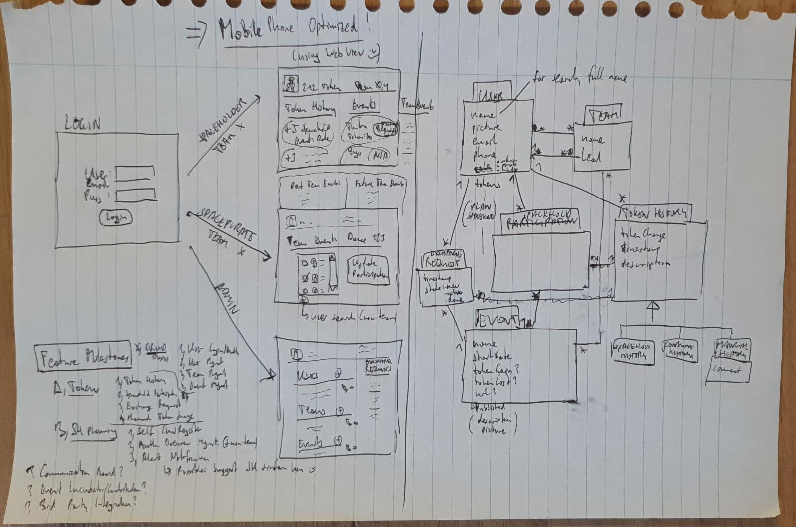

# Requirements

**Overall goal**: Spaceholders can volunteer at events and receive tokens ("token economy") for that.
These can be used to exchange as an entrance ticket to other events. All to motivate to spacehold more, reward system. (Maybe in the future, people also give workshops for a bigger token reward)

**Overall description**: Spaceholders are like regular user. They are grouped into teams, and each team
has a team leader, a so-called "Spacepirate". Only a spacepirate can assign spaceholders to events (receive tokens).
A third group of users, admins, have the most privileges, can manage users/teams/events and freely manipulate tokens.

**Additional feature**: In order to plan enough presence of spaceholders during an event, each spaceholder can assign
himself on a list of "I will be there". This list will be then afterwards used by the spacepirate (with some additional
fine-tuning) to come up with the final "payout list".

## Use Cases

### Main Scenario Flow

1. Spaceholder registers to show up at an event.
2. Spacepirate confirms afterwards (payout of tokens).
3. Spaceholder requests exchange event ticket for tokens.
4. Admin sees new request and confirms.
5. Spaceholder receives notification that it was confirmed.

### Scenarios

* Scenario: Check tokens.
    * Given I'm logged in as a spaceholder
    * When I go to the main screen
    * Then I see my total balance of tokens
    * And I see a history of tokens received/spent
    * And I see events along with their token price

* Scenario: Register planned attendance.
    * Given I'm logged in as a spaceholder
    * When I select the next available event
    * Then I can register to be present

* Scenario: Token payout.
    * Given I'm logged in as a spacepirate
    * And I go to the most recent passed event
    * When I change and confirm attendance of spaceholders
    * Then each user's token balance and history has been changed

* Scenario: Non-team member token payout.
    * Given I'm logged in as a spacepirate
    * And I go to the most recent passed event
    * When I add a non-team spaceholder
    * Then that user's token balance and history has been changed

* Scenario: Token exchange request.
    * Given I'm logged in as a spaceholder
    * And I have at least as many tokens as needed for an event
    * When I go to the main screen
    * And click on an event exchange request
    * Then that event is marked as "request state"
    * And a notification is sent to the admins

* Scenario: Process token exchange request.
    * Given I'm logged in as an admin
    * And someone requested a token exchange
    * When I confirm the exchange
    * Then the exchange's state is changed to "confirmed"
    * And the user sees that event as "confirmed"
    * And the tokens are substracted from that user (including history)
    * And the user is notified

* An admin can manage (CRUD/link) users, teams, events and exchanges.
* An admin can manually modify token balance.

## Technical

* It should look'n'feel like a regular, native MobileApp (Odessa people use phones, not computers)
* It should be implemented in regular web technologies
* See for example: https://app.starbucks.com

## Misc Insights

* The event participation with the search for non-team members is the only (client-side) complex page
* No registration: Admin is creating all users
* In total there will be around 100 spaceholders, 10 spacepirates, 3 admins
* Alternative name for "token"? E.g.: Coin?
